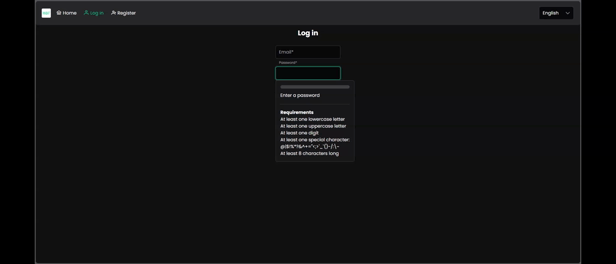

# HomeBudgetTracker

## Overview
Home Budget Tracker is a Java-based API designed to help users manage their personal finances. It allows users to track their income and expenses, categorize transactions, and generate reports in CSV format.  

## Features
* Simple JWT based user authentication and authorization
* Email verification for new users and password reset
* CRUD operations for accounts, categories and transactions
* Export transactions to CSV file
* Sum of positive or/and negative transactions
* Filter transactions by date or/and category within an account
* Get exchange rates via an external API when creating a new transaction if the currency is different from the account currency (you can also set the exchange rate manually)
* Exception handling
* Logging
* Some unit tests
* Deployment on Heroku
* Postgres database
* Docker setup
* Image upload for transaction to AWS S3
* Cloudfront signed URL with caching in database for image-related response (Presigned S3 URL and Cloudfront default URL are also available by environment variable value)

## In Progress or Planned
* Transaction details, including saving data related to the exchange
* Import transactions from a file (probably CSV, maybe PDF)
* More secure authentication
* Frontend (probably Vue + PrimeVue for UI - already have one in the other repository, but it has implemented only a few features and is not up to date)  

## Technologies Used
* Java
* Spring Boot
* Spring Security
* JPA/Hibernate
* Maven
* Lombok
* Apache Commons CSV
* AWS SDK
* AWS S3
* AWS Cloudfront
* Postgres
* Docker
* Heroku
* MailDev
* Swagger
* JUnit
* Mockito
* JWT

## Getting Started
***Installation***
1. Clone the repository:  
> * git clone https://github.com/MateuszMasternak/HomeBudgetTracker.git  
> * cd HomeBudgetTracker
2. Create the .env file and fill it up with the following environment variables:
>JWT_SECRET_KEY_DEV=yoursecretkey  
DB_NAME_DEV=yourdatabasename  
DB_USERNAME_DEV=yourusername  
DB_PASSWORD_DEV=yourpassword  
DB_HOST_DEV=postgres-hbt  
DB_PORT_DEV=5432  
MAILDEV_HOST_DEV=mail-dev-hbt  
EMAIL_USERNAME_DEV=username@test.com    
EMAIL_PASSWORD_DEV=password  
EXCHANGE_RATE_URL=https://v6.exchangerate-api.com/v6  
EXCHANGE_RATE_API_KEY=API_KEY // create an account at https://www.exchangerate-api.com/ for free and get your own KEY

> * If you want to run the application using features related to AWS, you need to clone the feature/images branch instead of the main branch, create S3 bucket instance and optionally Cloudfront instance, add the following environment variables to the .env file:  
> AWS_PROFILE_DEV=your-profile-name  
> AWS_S3_REGION_DEV=your-region  
> AWS_S3_BUCKET_DEV=your-bucket-name  
> AWS_S3_PRESIGNED_URL_EXPIRATION_TIME_DEV=1234 // in seconds  
> AWS_URL_TYPE_DEV=choice // either 's3' or 'cloudfront' or 'clodfront-signed'"  
> AWS_CLOUDFRONT_URL_DEV=your-cloudfront-url // leave default if you want to share images directly via S3  
> AWS_CLOUDFRONT_PUBLIC_KEY_PAIR_ID_DEV=cloud-front-public-key-id // leave default if you want to share images directly via S3 or default Cloudfront URL
> AWS_CLOUDFRONT_PRIVATE_KEY_DEV=cloud-front-private-key // leave default if you want to share images directly via S3 or default Cloudfront URL  
> * The profile should be configured in the ~/.aws/config file for example by aws configure sso through AWS CLI. Then you can login by aws sso login --profile your-profile-name. More info here: https://docs.aws.amazon.com/sdkref/latest/guide/access-sso.html. 
> * You can generate the private key by openssl genpkey -algorithm RSA -out private_key.pem -pkeyopt rsa_keygen_bits:2048.
> * You can generate the public key by openssl rsa -in private_key.pem -pubout -out public_key.pem.

***Docker Setup***
1. Build and run Docker containers:
> docker-compose up --build -d
> * The .env file is used by the Docker containers.
2. The API will be available at http://localhost:8080.  
3. Access the MailDev interface at http://localhost:1080 to view sent emails.

## API Endpoints
http://localhost:8080/swagger-ui/index.html
